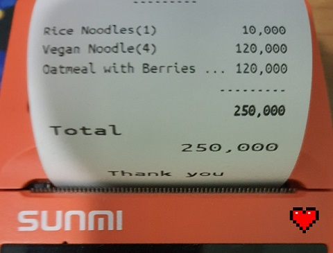

# Simple-POS

### ❤️❤️ [Online Demo](https://tcd93.github.io/flutter_pos2)❤️❤️
#### Login web demo
Type _admin/admin_ at login prompt.

A mobile POS written in _Flutter_, suitable for small cafe/restaurant, fully offline.

**Tested & printable on **Sunmi V1S** device.**



**Support:**

- Android
- Windows & Web (unable to print)

---

## Install & Run Project

Get [flutter](https://flutter.dev/)
**Tested on FLutter 3.16.9**

Create `.env` file at project root (see `.env.example`) to set up connection to 
[Auth0.com](https://auth0.com) login service provider. Create native/single web page 
applications and proceed as instructed at [Dashboard](https://manage.auth0.com/dashboard)


```
flutter pub get
flutter run
```